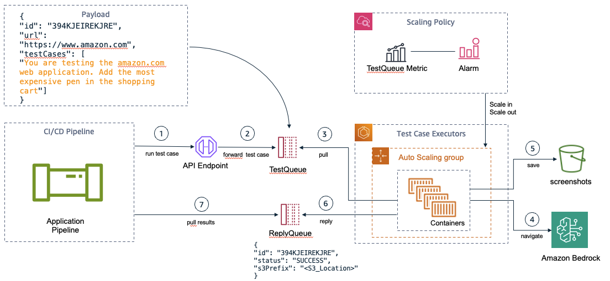

# Bedrock Test Automation using Selenium

Execute functional test cases in any web application using natural language. Move away from statically coding your test cases using tools like selenium or puppeteer. Let a generative ai agent test the scenario and provide you with the test results.

This project implements an automated web UI testing framework using Selenium to remotely control a browser and simulate user interactions on a site. A container executes test cases with the help of a LLM (Claude3 Sonnet). The LLM will navigate, choosing the actions that need to be executed. LLM is aware of HTML source code, actionable elements, his past actions and remaining interactions available.

## What it does

The solution can execute different types of test cases for authentication, creation of tickets, searching for products, adding products into shopping cart, empty shopping cart etc. It simulates clicking buttons, entering data and more to try to execute a functional test case in the application. You can run this project locally or remotelly within a AWS VPC as shown in the diagram:



## Requirements
To run this project, the following are needed:

- [Java 17](https://docs.aws.amazon.com/corretto/latest/corretto-17-ug/downloads-list.html) or higher
- [Apache Maven](https://maven.apache.org/download.cgi)
- [ChromeDriver](https://googlechromelabs.github.io/chrome-for-testing/) (or other browser driver depending on browser used for testing)
- An [AWS account](https://aws.amazon.com) with access to Amazon Bedrock and Claude3 Sonnet.
- Python 3 in case you decide to create a http server to run the sample application

## Running the sample test case (Amazon Cart)

- Clone the project repository
- Run `mvn package` to build the application
- Authenticate your CLI to your AWS environment
- Run locally using the debugger of your favorite IDE (I tested using VSCode)

```
java -jar target/genai-selenium-1.0-SNAPSHOT.jar 
```
- Run remotelly using API Gateway and SQS:

```
cdk deploy test-automation
#look for SERVICE_URL Output within the Outputs tab of the test-automation stack in AWS CloudFormation
export MY_API_GATEWAY_URL = 
curl "$MY_API_GATEWAY_URL" \
	-H 'Content-Type: application/json' -d @sample-test-payload.json \
	--user "$AWS_ACCESS_KEY_ID":"$AWS_SECRET_ACCESS_KEY" \
	--aws-sigv4 "aws:amz:us-east-1:execute-api"
```


## Contributing

Guideline for [contributing](CONTRIBUTING.md)

## License

This project is licensed under the [MIT-0](LICENSE) license.